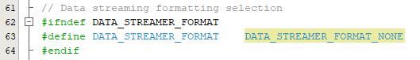
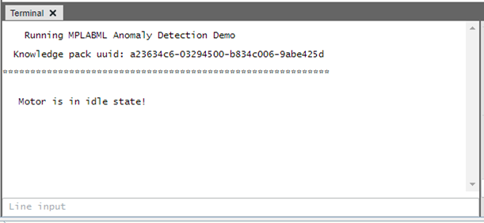
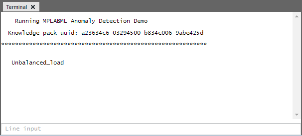
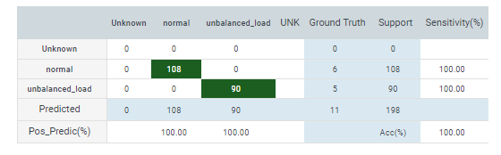

   

# Predictive Maintenance System for Industrial Motors
|  |
| :----------------------------------------------------------: |
|            Deployed Predictive Maintenance System            |

## Repository Overview
This repository is a companion to the [Predictive Maintenance with MPLAB ML tutorial](https://onlinedocs.microchip.com/oxy/GUID-80D4088D-19D0-41E9-BE8D-7AE3BE021BBF-en-US-3/GUID-E6CBB10A-FFC8-4EF3-8C07-D29B64446EB6.html). It contains the firmware to classify the operational state of a motor - whether the motor is in normal condition or experiencing any anomalies such as unbalanced load by monitoring Iq current of the motor on [dsPIC33CK LVMC Development Board](https://www.microchip.com/en-us/development-tool/dm330031) with the [24V 3-Phase Brushless DC Motor](https://www.microchip.com/en-us/development-tool/ac300020)

The supported Classifications (shown in the video above) are:

- *Normal operation*
- *Unbalanced load*

In addition, there is also an 'unknown' class for the operation those don't fall under these categories.

## Hardware Used
* dsPIC33CK LVMC Development Board [(DM330031)](https://www.microchip.com/en-us/development-tool/dm330031)
* 24V 3-Phase Brushless DC Motor [(AC300020)](https://www.microchip.com/en-us/development-tool/ac300020)

## Software Used
* [MPLAB® X IDE](https://microchip.com/mplab/mplab-x-ide)
* [MPLAB® XC16 Compiler](https://microchip.com/mplab/compilers)
* [MPLAB® Code Configurator](https://www.microchip.com/en-us/tools-resources/configure/mplab-code-configurator)
* [MPLAB® ML Model Builder](https://onlinedocs.microchip.com/v2/keyword-lookup?keyword=MPLAB-ML-Documentation&redirect=true)

## Related Documentation
* dsPIC33CH512MP508 [Product Family Page](https://www.microchip.com/en-us/product/dspic33ch512mp508)
* motorBench® Development Suite [Software Plugin Details](https://www.microchip.com/en-us/solutions/technologies/motor-control-and-drive/motorbench-development-suite)

## Data Collection
The [dataset](/dataset) used for the development of this application consists of Motor IQ current and Motor RPM measurements taken from a 24V 3-Phase Brushless DC Motor connected to a dsPIC33CK LVMC Development Board, running on an FOC motor control algorithm. No sensors were used in this application. For further description of the application setup, see the [Predictive Maintenance with MPLAB ML tutorial](TBA). 

## Data Collection Firmware
A binary build of the data logging firmware used in the data collection for this project can be found in the [binaries folder of this repo](/binaries); to build data logging firmware for different  configurations, visit the [ml-33ck265mp508-lvmc-datalogger](TBA) repository.

## Firmware Operation

The behavior of the firmware can be summarized as operating in one of the distinct states described in the table below.

| State           | UART Terminal output          | Description                                                  |
| --------------- | ----------------------------- | ------------------------------------------------------------ |
| Motor OFF       | Motor is in idle state!       | Motor is in off state                                        |
| Normal          | Normal_Operation              | Motor is running normally(no load or balanced load)          |
| Unbalanced load | Unbalanced_load               | Unbalanced load is detected                                  |
| Buffer Overflow | Overrun!                      | Processing is not able to keep up with real-time; data buffer has been reset. |
| ERROR           | ERROR: Got a bad motor status | The motor controller has recognized a fault condition, under which it is unable to proceed safely with normal control activities. |

Note the firmware class ID mapping is as below:

- *Unknown* - 0 (input outside of modeled behavior)
- *Normal_Operation* - 1
- *Unbalanced load* - 2

## Running the application Demo

 

- Start MPLAB X IDE and open the project `anomaly-detection-ml-33ck256mp508-lvmc.X` with device selection dsPIC33CK256MP508.

- Set the project `anomaly-detection-ml-33ck256mp508-lvmc.X` as the main project.

- Open the `app_config.h` file located under Header Files. 

- Ensure that the macro **`DATA_STREAMER_FORMAT`** is set as **`DATA_STREAMER_FORMAT_NONE`**

​                               
                       

 

- Open project properties and ensure that the selected MPLAB® XC16 Compiler and Device Pack support the device configured in the firmware. 

- Build the project and program the device. 

- Open the terminal window on Data Visualizer, select COM port of LVMC board and set below configurations
  - Baud rate 115200
  - Data bits 8
  - Stop bits 1
  - Parity None

The below message will be printed right after device reset. Indicating Knowledge pack number and the motor status. 

  

- Press switch SW1 to start the motor. If the motor runs normally, the below  output will be shown. 

 

If an unbalanced load is detected:

 

## Firmware Benchmark
With  ``-O2`` level compiler optimizations, and 100MHz clock (Fcy)
- 25.9kB Flash
- 9.3kB RAM
- 25ms Inference time(average)

## Classifier Performance
Below is the confusion matrix for the test dataset. Note that the classes are highly imbalanced so accuracy is not a good indicator of overall performance.

